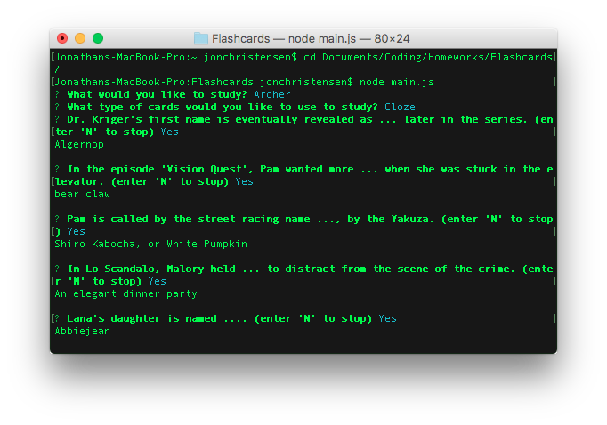

# Flashcards
Flashcards is a commmand line application accessed that creates flashcards for studying. It is run using Node.js, and makes use of constructor objects and the Inquirer module.

## Description

Flashcards allows you to study one of four topics and currently supports American History, Math, English, and Archer the TV Series. After selecting a topic, the participant then chooses to study with standard flashcards or Cloze-Deleted flashcards. All questions in each topic bank are then loaded in random order, with the participant given the option to continue or cease studying after each flashcard.

The standard flashcards will ask you a question and then provide you with the answer. The cloze card variants have the same answer, but instead provide a phrase with the answer omitted. For example, a clozecard might ask, "... was the first president of the United States", with the answer being "George Washington". Both are types of flashcards are made using JavaScript constructors.

### Development

This application was developed as part of the GW Coding Bootcamp and was completed during the sixth week.

### Organization

This repo can be cloned to your computer and accessed using the following command:

		git clone https://github.com/jonchr/Flashcards.git
		cd Flashcards
		node main.js

## Screenshots
### Studying Archer with Cloze Flashcards
